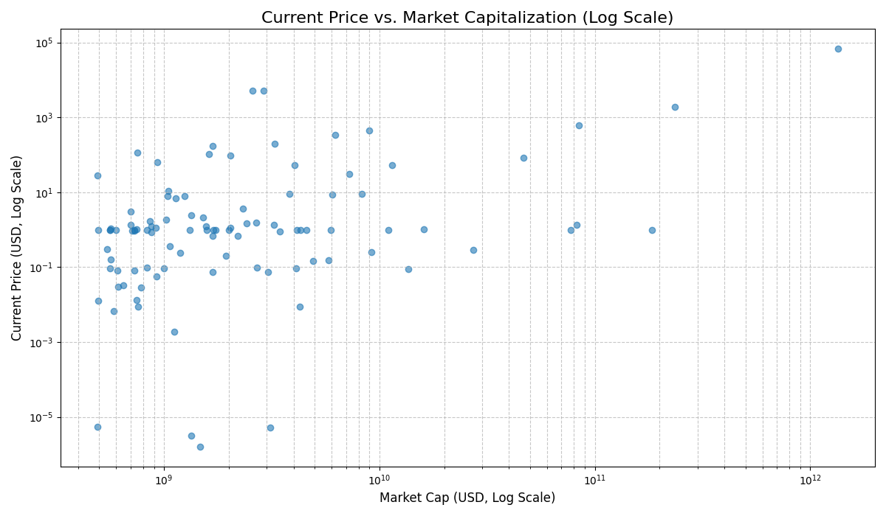
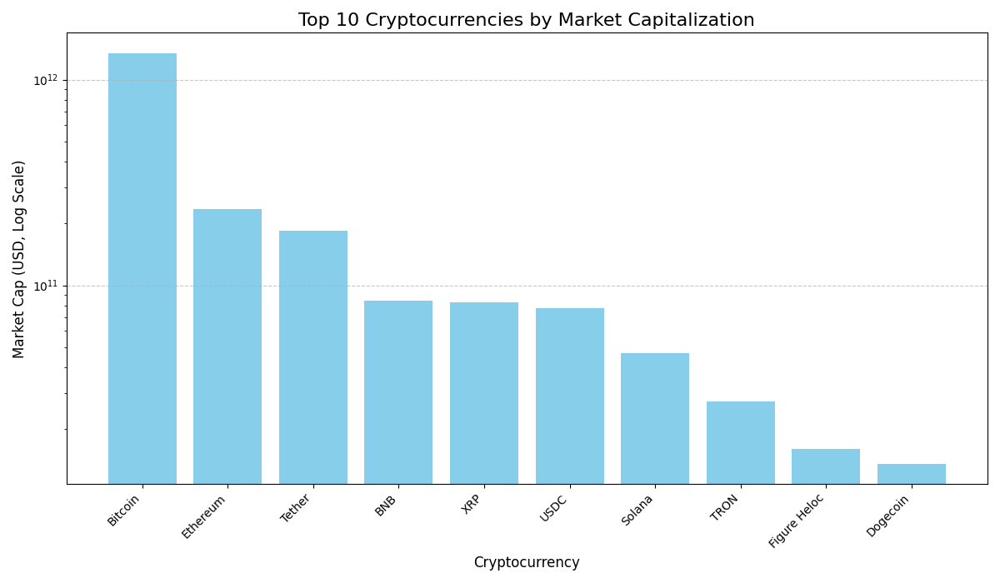
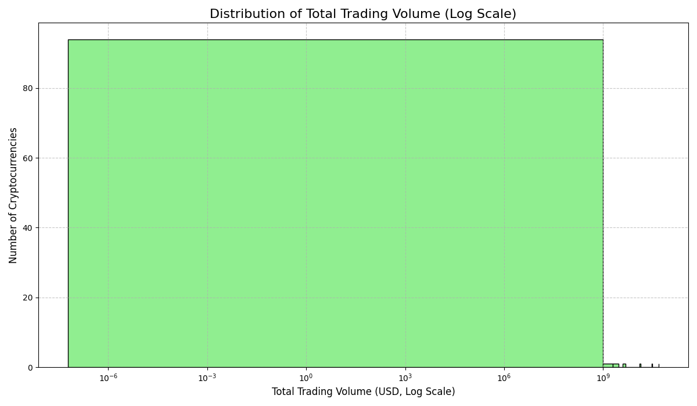

# 🚀 Cryptocurrency Market Analysis using Python

## 📌 Project Overview

This project performs **Exploratory Data Analysis (EDA)** on cryptocurrency market data using Python.
The objective is to analyze **price trends, market capitalization, and trading volume** to understand patterns in the cryptocurrency market.

The analysis includes data cleaning, visualization, and insights using Python data analysis libraries.

---

## 🎯 Objectives

* Analyze cryptocurrency price trends
* Compare market capitalization of different cryptocurrencies
* Study trading volume distribution
* Visualize patterns in the crypto market

---

## 🛠️ Tools & Technologies

* Python
* Pandas
* NumPy
* Matplotlib
* Seaborn
* Jupyter Notebook / Google Colab

---

## 📂 Project Structure

```
crypto-market-analysis
│
├── crypto_analysis.ipynb
├── README.md
├── requirements.txt
├── .gitignore
│
├── data
│   └── crypto_dataset.csv
│
├── images
│   ├── price_trend.png
│   ├── market_cap.png
│   └── total_volume_histogram.png
│
└── docs
    └── project_overview.md
```

---

## 📊 Visualizations

### 📈 Price Trend Analysis

Shows how cryptocurrency prices change over time.



---

### 💰 Market Capitalization Analysis

Compares the market capitalization of major cryptocurrencies.



---

### 📊 Trading Volume Distribution

Displays the distribution of total trading volume across cryptocurrencies.



---

## 🔎 Key Insights

* Major cryptocurrencies dominate overall market capitalization.
* Price trends show significant volatility in the crypto market.
* Trading volume distribution highlights active cryptocurrencies.

---

## ▶️ How to Run the Project

### 1️⃣ Clone the repository

```
git clone https://github.com/yourusername/crypto-market-analysis.git
```

### 2️⃣ Install dependencies

```
pip install -r requirements.txt
```

### 3️⃣ Run the notebook

Open the file:

```
crypto_analysis.ipynb
```

in Jupyter Notebook or Google Colab.

---

## 📌 Future Improvements

* Add more cryptocurrencies for analysis
* Perform time series forecasting
* Build interactive dashboards using Plotly
* Deploy analysis using Streamlit

---

## 👨‍💻 Author

Avishkar Menge
Python Data Analyst
